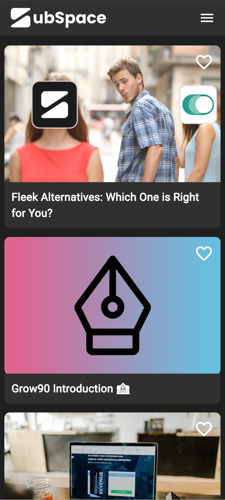
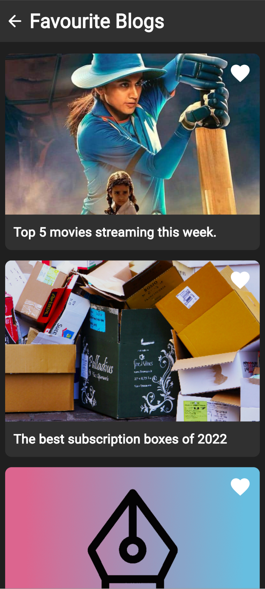

# Subspace assignment

Thank you for considering my application. I am very excited to work with you guys in the future

## Features

- API Integration.
- Offline Mode.
- Add to favourites feature.

## Screenshots

<div style="display: flex; justify-content: space-between;">
  
  
</div>

## Installation

Follow these steps to get MusicStream Pro up and running on your device:

1. Clone this repository to your local machine:

   ```sh
   git clone https://github.com/burhanuddin-limdi/subspace_assignment.git
   ```

2. Navigate to the project directory:

   ```sh
   cd subspace_assignment
   ```

3. Install the required dependencies:

   ```sh
   flutter pub get
   ```

4. Run the app:

   ```sh
   flutter run
   ```
